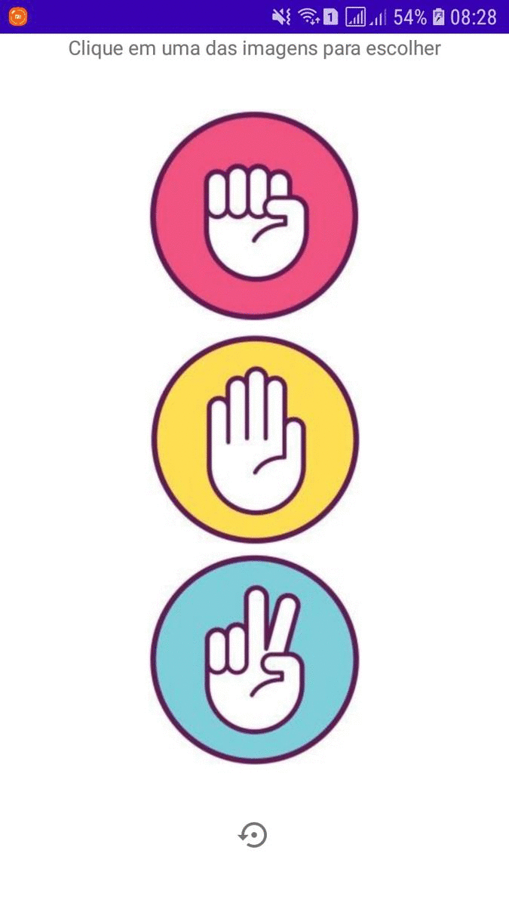

# :scissors: Pedra, papel, tesoura v1.0
Essa aplicação permite ao usuário jogar pedra, papel, tesoura com o aplicativo. O usuário escolhe sua jogada e logo em seguida 
o app gera uma jogada aleatória. Os resultados históricos são salvos no shared preferences do app.

## :computer: Tecnologias

Este projeto foi desenvolvido com as seguintes tecnologias:

-  [Java](https://www.java.com/pt-BR/)
-  [Android](https://developer.android.com/docs)
-  [Android Studio](https://developer.android.com/studio)

### :arrow_forward: Em Execução:

<p align="center">
 
</p>

### :information_source: Como usar:

Para clonar e executar este aplicativo, você precisará do Git e Android Studio instalados em seu computador. Na linha de comando:

```bash
# Clonar este repositório
$ git clone https://github.com/DiegoTeixeira7/PedraPapelTesoura.git

# Abra o projeto em seu Android Studio e execute

```
### :memo: Licença
Este projeto está sob a licença do MIT. Consulte a [LICENSE](https://github.com/DiegoTeixeira7/PedraPapelTesoura/blob/master/LICENSE) para obter mais informações.
